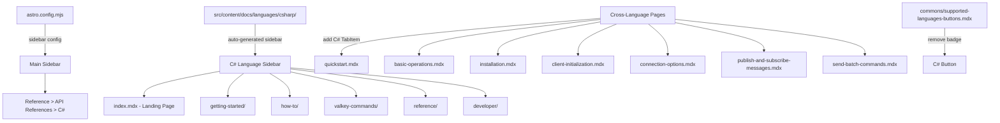

# Design Document: C# Client Documentation

## Overview

This design covers adding comprehensive C# client documentation to the Valkey GLIDE documentation website. The C# client (`valkey-glide-csharp`) currently has only a "Coming Soon" placeholder at `src/content/docs/languages/csharp/index.mdx`. This feature will:

1. Replace the placeholder with a full landing page
2. Create language-specific pages (getting-started, how-to guides, valkey-commands, reference, developer)
3. Add C# tabs to all cross-language pages (quickstart, basic-operations, installation, client-initialization, connection-options, pub/sub, batch commands)
4. Update the sidebar configuration in `astro.config.mjs` to include a C# API reference link
5. Remove the "coming soon" badge from the supported languages buttons

The documentation follows the established patterns from Go, Java, Python, Node.js, and PHP language docs. All C# code examples must reflect the actual public API of the `valkey-glide-csharp` repository, using idiomatic `async/await` patterns, proper `using` statements, and correct class/method names.

### Key Design Decisions

- **Follow Go docs as primary template**: The Go docs are the most recently added and represent the cleanest pattern. C# docs will mirror Go's structure (landing page, getting-started, how-to, valkey-commands, reference, developer).
- **No migration section initially**: Unlike Java and Go, there is no migration guide needed at launch since C# is a new client.
- **No concepts section initially**: Advanced concept pages (like Go's goroutine-safety or Java's thread-safety) can be added later as the C# client matures.
- **Sidebar auto-generation**: Language-specific pages use Starlight's auto-generated sidebar from directory structure (controlled by frontmatter `sidebar.order`), not explicit entries in `astro.config.mjs`. Only the API Reference link needs to be added to the main sidebar config.
- **Cross-language tab label**: Use `"C#"` as the tab label, consistent with the existing button in `supported-languages-buttons.mdx`.
- **Conditional cross-language inclusion**: C# tabs are only added to cross-language how-to pages where the C# client supports the functionality. If a feature is unsupported, the tab is omitted per Requirement 10.4.

## Architecture

The documentation follows the Astro/Starlight static site architecture already in place. No new architectural components are needed.



### File Change Categories

1. **New files** (14 MDX files under `src/content/docs/languages/csharp/`)
2. **Modified cross-language files** (7 existing MDX files getting C# tabs)
3. **Modified config/commons files** (2 files: `astro.config.mjs`, `supported-languages-buttons.mdx`)

## Components and Interfaces

### New C# Language-Specific Pages

All pages are MDX files under `src/content/docs/languages/csharp/` and follow the same frontmatter and import patterns as Go docs.

#### File Structure

```
src/content/docs/languages/csharp/
├── index.mdx                                          # Landing page (Req 1)
├── getting-started/
│   ├── getting-started.mdx                            # Getting started guide (Req 2)
│   └── first-app.mdx                                  # First app tutorial (Req 2)
├── how-to/
│   ├── Client-Initialization.mdx                      # Client init guide (Req 4)
│   ├── Authentication.mdx                             # Auth guide (Req 4)
│   ├── TLS.mdx                                        # TLS guide (Req 4)
│   ├── Timeouts-and-Reconnect-Strategy.mdx            # Timeouts guide (Req 4)
│   └── Read-Strategy.mdx                              # Read strategy guide (Req 4)
├── valkey-commands/
│   ├── index.mdx                                      # Commands overview (Req 5)
│   └── batch-transaction-and-pipelining.mdx           # Batch/pipeline guide (Req 5)
├── reference/
│   ├── api-reference.mdx                              # API reference links (Req 6)
│   └── configuration.mdx                              # Config reference (Req 6)
└── developer/
    ├── index.mdx                                      # Developer overview (Req 7)
    ├── Build-from-source.mdx                          # Build guide (Req 7)
    └── Community-and-Feedback.mdx                     # Community links (Req 7)
```

### Modified Cross-Language Pages

Each of these existing files gets a new `<TabItem label="C#">` added inside their `<Tabs>` or `<ParamTabs>` components:

| File                                        | Modification                                     | Requirement |
| ------------------------------------------- | ------------------------------------------------ | ----------- |
| `getting-started/quickstart.mdx`            | Add C# tab to install, ping, and config sections | Req 3.2     |
| `getting-started/basic-operations.mdx`      | Add C# tab to SET/GET, MSET/MGET, DEL sections   | Req 3.3     |
| `how-to/installation.mdx`                   | Add C# tab with NuGet install instructions       | Req 3.4     |
| `how-to/client-initialization.mdx`          | Add C# tab to cluster and standalone sections    | Req 3.5     |
| `reference/connection-options.mdx`          | Add C# row to table and tab to example           | Req 3.6     |
| `how-to/publish-and-subscribe-messages.mdx` | Add C# tab if pub/sub is supported               | Req 10.2    |
| `how-to/send-batch-commands.mdx`            | Add C# tab if batch operations are supported     | Req 10.3    |

### Modified Configuration/Commons Files

| File                                      | Modification                                        | Requirement |
| ----------------------------------------- | --------------------------------------------------- | ----------- |
| `astro.config.mjs`                        | Add C# entry under Reference > API References       | Req 8.2     |
| `commons/supported-languages-buttons.mdx` | Remove `<Badge text="coming soon!">` from C# button | Req 9       |

### MDX Page Template Pattern

Each C# language-specific page follows this frontmatter pattern (mirroring Go):

```mdx
---
title: [Page Title]
description: [Description]
sidebar:
  order: [number] # Only on pages needing explicit ordering
---

import { Aside } from "@astrojs/starlight/components";

[Content with C# code examples]
```

### Cross-Language Tab Pattern

C# tabs are added as `<TabItem label="C#">` inside existing `<Tabs syncKey="progLangInExamples">` or `<ParamTabs>` blocks. The tab is placed after Go and before PHP (alphabetical by language name within the existing order, or at the end if no clear convention):

````mdx
<TabItem label="C#">
```csharp
using Valkey.Glide;

// C# code example
````

</TabItem>
```

### C# Client API Patterns

Based on the `valkey-glide-csharp` repository, the C# client uses these patterns:

**Namespace**: `Valkey.Glide`

**Client Classes**:

- `GlideClient` — standalone client
- `GlideClusterClient` — cluster client

**Configuration Classes**:

- `GlideClientConfiguration` — standalone config
- `GlideClusterClientConfiguration` — cluster config
- `NodeAddress` — server address
- `ServerCredentials` — authentication credentials

**Async Pattern**: All commands return `Task<T>` and use `async/await`

**Client Creation**:

```csharp
using Valkey.Glide;

// Standalone
var config = new GlideClientConfiguration()
{
    Addresses = { new NodeAddress("localhost", 6379) }
};
var client = await GlideClient.CreateClientAsync(config);

// Cluster
var clusterConfig = new GlideClusterClientConfiguration()
{
    Addresses = { new NodeAddress("localhost", 6379) }
};
var clusterClient = await GlideClusterClient.CreateClientAsync(clusterConfig);
```

**Command Execution**:

```csharp
// Basic operations
await client.SetAsync("key", "value");
var result = await client.GetAsync("key");
await client.PingAsync();

// Cleanup
client.Dispose();
```

**Configuration Options**:

```csharp
var config = new GlideClientConfiguration()
{
    Addresses = { new NodeAddress("localhost", 6379) },
    UseTls = true,
    RequestTimeout = TimeSpan.FromMilliseconds(5000),
    Credentials = new ServerCredentials("username", "password"),
    DatabaseId = 0,
    ClientName = "my-app",
    ReadFrom = ReadFrom.PreferReplica,
    ReconnectStrategy = new BackoffStrategy(5, 10, 50)
};
```

## Data Models

This feature is purely documentation — no runtime data models are introduced. The "data" consists of:

1. **MDX frontmatter**: YAML metadata (title, description, sidebar order, draft status) controlling Starlight page rendering
2. **Astro sidebar configuration**: JavaScript objects in `astro.config.mjs` defining navigation structure
3. **Code examples**: C# code snippets embedded in MDX that demonstrate the `valkey-glide-csharp` API

### Frontmatter Schema (per Starlight conventions)

```yaml
---
title: string # Page title displayed in sidebar and header
description: string # Meta description for SEO
sidebar:
  order: number # Optional: controls ordering within auto-generated sidebar
  badge:
    text: string # Optional: badge text (e.g., "Placeholder")
    variant: string # Optional: badge style (e.g., "note")
draft: boolean # Optional: if true, page is hidden in production
---
```

### Sidebar Configuration Entry (for API Reference)

```javascript
{
  label: "C#",
  link: "https://github.com/valkey-io/valkey-glide-csharp",
  attrs: { style: "font-style: italic", target: "_blank" },
}
```

## Correctness Properties

_A property is a characteristic or behavior that should hold true across all valid executions of a system — essentially, a formal statement about what the system should do. Properties serve as the bridge between human-readable specifications and machine-verifiable correctness guarantees._

Most acceptance criteria for this feature are specific file existence and content checks (examples), not universal properties. However, three properties emerge from the prework analysis after consolidation:

### Property 1: Cross-language C# tab inclusion correctness

_For any_ cross-language page that contains tabbed code examples (`<Tabs syncKey="progLangInExamples">` or `<ParamTabs>`), if the C# client supports the functionality demonstrated on that page, then the page SHALL contain a `<TabItem label="C#">` with C# code content; and if the C# client does NOT support the functionality, then the page SHALL NOT contain a C# TabItem.

**Validates: Requirements 3.1, 10.4**

### Property 2: C# code example API correctness

_For any_ C# code block across all documentation pages (both language-specific and cross-language), the code SHALL: (a) use the `Valkey.Glide` namespace via a `using Valkey.Glide;` statement when referencing GLIDE types, (b) use `async/await` patterns for all client command calls, and (c) reference only class names and method signatures that exist in the `valkey-glide-csharp` public API (e.g., `GlideClient`, `GlideClusterClient`, `GlideClientConfiguration`, `GlideClusterClientConfiguration`, `NodeAddress`, `ServerCredentials`).

**Validates: Requirements 4.6, 11.1, 11.2, 11.4**

### Property 3: C# directory structure completeness

_For any_ language that has full documentation on the site (Java, Go, Python, Node.js, PHP), the C# language directory SHALL contain the same set of required subdirectories: `getting-started/`, `how-to/`, `valkey-commands/`, `reference/`, and `developer/`, each with at least one MDX file.

**Validates: Requirements 8.1**

## Error Handling

This feature is purely documentation content — there are no runtime error handling concerns. The relevant "errors" are:

1. **Build errors**: If MDX files have invalid syntax, broken imports, or incorrect frontmatter, the Astro build (`pnpm build`) will fail. All new and modified files must pass the build.
2. **Broken links**: Internal links to C# pages or cross-references must resolve correctly. The site uses `lychee` for link checking (see `lychee.toml`).
3. **Missing tab content**: If a C# TabItem is added but left empty or has malformed code blocks, the page will render incorrectly.
4. **Import errors**: MDX files that import shared components (e.g., `SupportedEngineVersions`) must use correct relative paths.

Mitigation: Run `pnpm build` after all changes to catch build-time errors. Verify all internal links resolve.

## Testing Strategy

### Build Verification (Primary)

The primary validation for documentation changes is the Astro build:

```bash
pnpm build
pnpm format
```

This catches:

- MDX syntax errors
- Broken imports
- Invalid frontmatter
- Component usage errors

### Unit Tests (Example-Based)

Since most acceptance criteria are specific file existence and content checks, unit tests should verify:

1. **File existence**: All 14 new C# MDX files exist at their specified paths
2. **Content presence**: Key content sections exist in each file (e.g., landing page has system requirements, getting-started has NuGet instructions)
3. **Content absence**: The "Coming Soon" caution aside is removed from `index.mdx`; the "coming soon" badge is removed from `supported-languages-buttons.mdx`
4. **Cross-language tab presence**: Each modified cross-language page contains a `<TabItem label="C#">` element
5. **Sidebar config**: `astro.config.mjs` contains a C# entry in the API References section
6. **Code example correctness**: C# code blocks contain `using Valkey.Glide`, use `async/await`, and reference correct class names

### Property-Based Tests

Property-based tests should use a JavaScript/TypeScript PBT library (e.g., `fast-check`) with minimum 100 iterations per property. Since the properties operate over a finite set of files, the generators will produce random selections from the known file sets.

Each property test must be tagged with a comment referencing the design property:

- **Feature: csharp-client-docs, Property 1: Cross-language C# tab inclusion correctness**
- **Feature: csharp-client-docs, Property 2: C# code example API correctness**
- **Feature: csharp-client-docs, Property 3: C# directory structure completeness**

**Property 1 test**: Generate random selections from the set of all cross-language pages. For each selected page, parse the MDX content and verify that if the page has `<Tabs syncKey="progLangInExamples">`, it either has a C# tab (if the feature is supported) or doesn't (if unsupported).

**Property 2 test**: Generate random selections from the set of all MDX files containing C# code blocks. For each code block, verify it contains `using Valkey.Glide`, uses `await` for client method calls, and references only known API class names.

**Property 3 test**: Generate random selections from the set of documented languages. For each language, verify the directory contains the required subdirectories with at least one MDX file each. The C# directory must match this structure.

### Manual Verification

- Visual review of rendered pages in the dev server (`pnpm dev`)
- Verify tab switching works correctly on cross-language pages
- Verify sidebar navigation renders C# sections correctly
- Verify the C# button on the supported languages page links correctly
