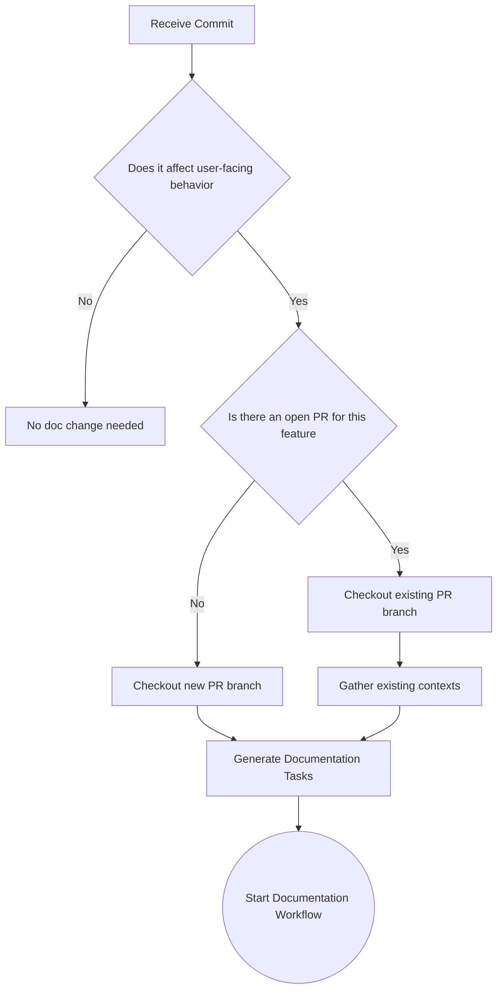
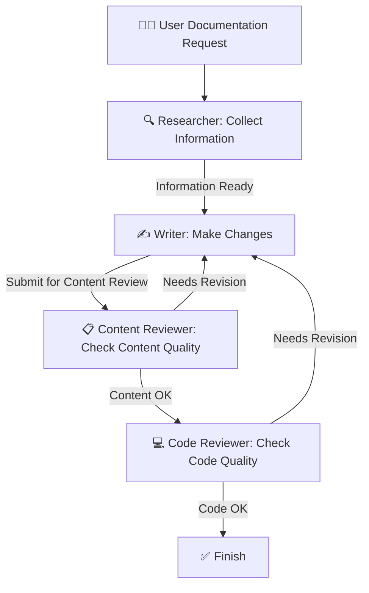

# Doc Scope Decision Flowchart

Agentic workflow for deciding documentation scope given a commit to Valkey GLIDE (Rust core + multi-language client wrappers).

```mermaid
flowchart TD
    A[Receive Commit] --> B{Does it affect user-facing behavior}
    B -->|No| C[No doc change needed]
    B -->|Yes| D{Is there an open PR for this feature}
    D -->|Yes| E[Checkout existing PR branch]
    D -->|No| I[Checkout new PR branch]
    I --> F[Generate Documentation Tasks]
    E --> G[Gather existing contexts]
    G --> F
    F --> H((Start Documentation Workflow))
```

# Documentation flow

```mermaid
flowchart TB
    userReq["🧑‍💻 User Documentation Request"] --> researcher["🔍 Researcher: Collect Information"]
    researcher -- Information Ready --> writer["✍️ Writer: Make Changes"]
    writer -- Submit for Content Review --> contentRev["📋 Content Reviewer: Check Content Quality"]
    contentRev -- Content OK --> codeRev["💻 Code Reviewer: Check Code Quality"]
    codeRev -- Code OK --> final["✅ Finish"]
    contentRev -- Needs Revision --> writer
    codeRev -- Needs Revision --> writer
```