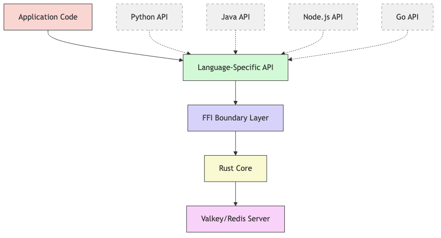

## Why Valkey Glide?

Valkey GLIDE begins by offering simplicity and reliability out of the box. Your application benefits from the thousands of hours of experience distilled into a reliable, scalable and easy to use library. Valkey GLIDE is built from the ground up for enterprise workloads, it delivers the reliability and performance your business demands without the operational complexity that kills productivity.

Your applications stay online during traffic spikes, your developers ship features faster, and your operations team thank you.

## What Makes Valkey GLIDE Different

### One Core, Multiple Languages

Valkey GLIDE uses a single, battle-tested Rust core with thin language bindings. This means identical behaviour across Python, Java, Node.js, Go, and C#, which is especially helpful if your team works on a multi-language project. Performance, debugging and troubleshooting are consistent whatever language you choose.

### Enterprise-Ready from Day One

Built specifically for production workloads with features that are important to your business:

- **Intelligent connection management** with automatic failover
- **Built-in request throttling** prevents server overload (configurable, defaults to 1000 concurrent requests)
- **Cluster topology awareness** with automatic slot migration handling
- **Comprehensive monitoring** with OpenTelemetry integration out of the box

### Cloud-Native Architecture

Designed for modern cloud deployments:

- **Availability zone awareness** for optimal performance in multi-AZ setups
- **Automatic retry logic** with exponential backoff
- **TLS support** for secure communication
- **Cross-platform consistency** across operating systems and environments

## Client Comparison

### Java: Jedis vs Valkey GLIDE

| Feature | Jedis | Valkey GLIDE |
|---------|-------|--------------|
| **Multi-language consistency** | Java-only | Consistent across all languages |
| **Connection pooling** | Basic | Advanced with automatic failover |
| **Cluster support** | Limited | Full cluster topology awareness |
| **Built-in monitoring** | None | OpenTelemetry + metrics |
| **Request throttling** | Manual implementation | Built-in with configurable limits |
| **Async support** | Limited | Full async/await support |
| **Production reliability** | Requires additional tooling | Enterprise-ready out of the box |

### C#: StackExchange.Redis vs Valkey GLIDE

| Feature | StackExchange.Redis | Valkey GLIDE |
|---------|---------------------|--------------|
| **Cross-language consistency** | C#-only | Consistent behavior across languages |
| **Cluster failover** | Basic | Intelligent with slot migration handling |
| **Monitoring integration** | Custom implementation needed | Built-in OpenTelemetry support |
| **Connection management** | Good | Superior with AZ awareness |
| **Development status** | Mature | Actively developed (C# in development) |

### Python: redis-py vs Valkey GLIDE

| Feature | redis-py | Valkey GLIDE |
|---------|----------|--------------|
| **Performance** | Pure Python overhead | Rust core performance |
| **Cluster operations** | Basic | Advanced with intelligent routing |
| **Connection reliability** | Manual retry logic | Automatic with exponential backoff |
| **Monitoring** | Third-party tools required | Built-in metrics and tracing |
| **Multi-language projects** | Inconsistent with other clients | Identical behavior across languages |
| **PubSub reliability** | Connection issues common | Robust with automatic reconnection |

### Node.js: node_redis vs Valkey GLIDE

| Feature | node_redis | Valkey GLIDE |
|---------|------------|--------------|
| **TypeScript support** | Good | Excellent with full type safety |
| **Cluster management** | Manual topology updates | Automatic topology awareness |
| **Error handling** | Inconsistent patterns | Unified error handling across languages |
| **Performance** | JavaScript overhead | Native Rust performance |
| **Production features** | Requires additional libraries | Enterprise features built-in |

### Go: go-redis vs Valkey GLIDE

| Feature | go-redis | Valkey GLIDE |
|---------|----------|--------------|
| **Consistency with other languages** | Go-specific patterns | Unified API design |
| **Cluster support** | Good | Superior with advanced features |
| **Built-in observability** | Limited | Comprehensive monitoring |
| **Connection pooling** | Standard | Advanced with AZ awareness |
| **Status** | Mature | Public preview with active development |

---

## Architecture That Scales

### The Power of a Unified Core
Valkey GLIDE uses a layered architecture with a Rust core and language-specific bindings. This design ensures consistency across languages while allowing for idiomatic interfaces in each supported programming language

## Key Components Explained
### Application Layer
This is where your application code interacts with Valkey GLIDE. The application layer is responsible for:

Command Creation: Applications construct commands using language-specific APIs
Parameter Validation: Type checking and validation before command execution
Result Processing: Handling returned data in language-appropriate formats
Error Handling: Application-level error handling and recovery strategies
Applications can interact with Valkey GLIDE in both synchronous and asynchronous modes, depending on the language and configuration.

### Language Binding Layer
The language binding layer provides idiomatic interfaces for each supported programming language:

Python: Offers Pythonic APIs with support for async/await, context managers, and type hints
Java: Provides Java-style interfaces with proper exception handling and Java collections integration
Node.js: Implements Promise-based APIs and callback patterns familiar to JavaScript developers
Go (public preview): Exposes Go-idiomatic interfaces with proper error handling and concurrency patterns
C# - Currently under active development.
Each language binding is responsible for:

Type Conversion: Converting language-specific types to FFI-compatible formats
Memory Management: Coordinating with language garbage collectors
API Design: Providing language-appropriate patterns and idioms
Documentation: Generating language-specific documentation and examples

### FFI Boundary Layer
The Foreign Function Interface (FFI) boundary is the critical bridge between language-specific code and the Rust core. This layer:

Defines Data Exchange Contracts: Strict interfaces for passing data between languages
Manages Memory Ownership: Controls how memory is shared and transferred
Handles Callbacks: Enables event propagation across language boundaries
Ensures Safety: Prevents memory leaks and undefined behavior
The FFI layer is implemented using language-specific FFI mechanisms:

Python: Uses PyO3
Java: Uses JNI (Java Native Interface)
Node.js: Uses N-API
Go: Uses CGO

### Rust Core Layer
The heart of Valkey GLIDE is implemented in Rust, providing:

Command Routing: Determines which node should receive each command
Connection Management: Maintains and monitors connection pools
Protocol Handling: Implements the Redis Serialization Protocol (RESP)
Cluster Topology: Tracks and updates cluster node information
Error Handling: Implements retry logic
The Rust core ensures consistent behavior across all language bindings while leveraging Rust's safety guarantees and performance characteristics.

### Network Communication Layer
The network layer handles all communication with Valkey/Redis servers:

TCP Connection Management: Establishes and maintains TCP connections
TLS Support: Implements secure communication when configured
I/O Buffering: Optimizes network buffer usage for performance
Timeout Handling: Manages connection and command timeouts
